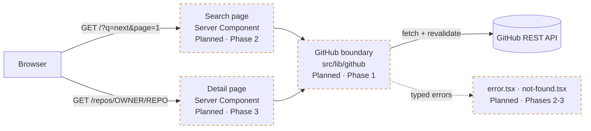
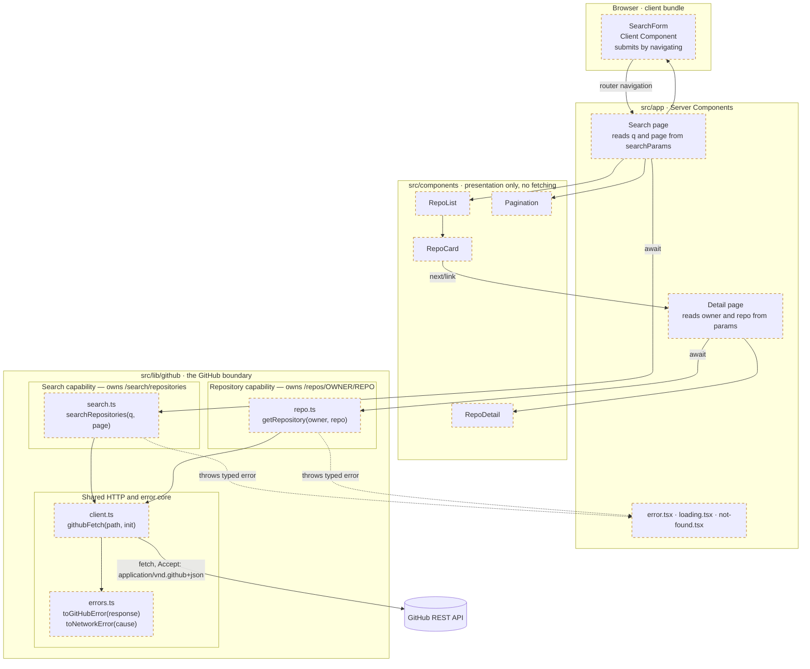
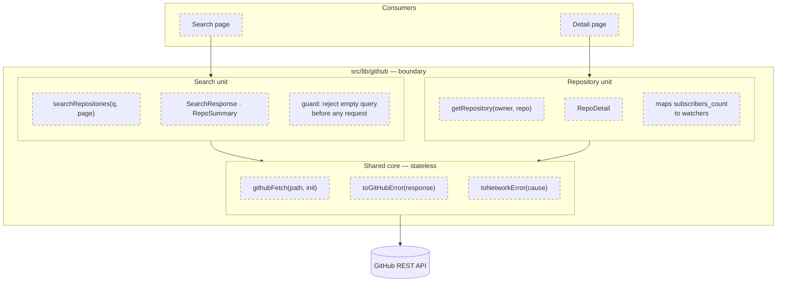
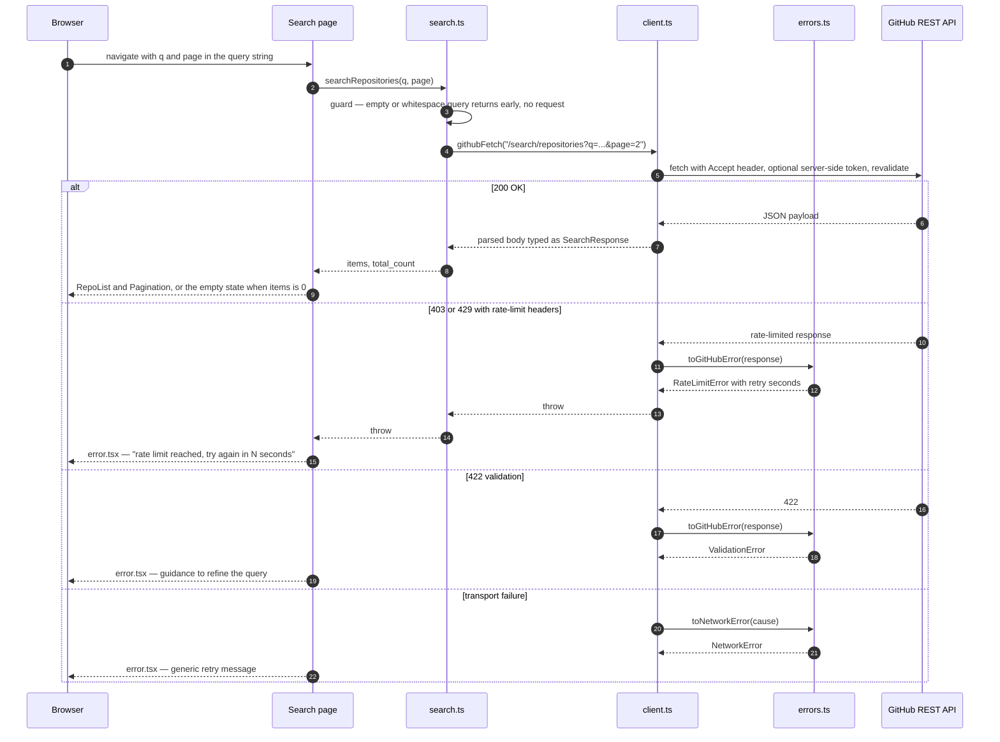
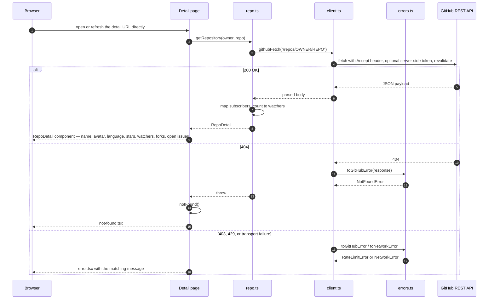

<!-- generated-by: gsd-doc-writer -->
# Architecture

How this app is put together and why. Decisions that were considered and rejected are recorded here too — for a selection task, the reasoning is part of the deliverable.

> **Read this as a design contract, not a description of finished code.** At the time of writing, the repository contains the scaffold, the test harness, and the CI quality gate. The search route, the detail route, the components, and the GitHub client are specified here and built in the phases named below. Everything in this document is tagged so intent is never mistaken for reality.

## Build status legend

| Tag | Meaning |
|---|---|
| **Built** | Exists in the repository today and is exercised by `npm test` / `npm run build` / CI |
| **Planned · Phase N** | Specified here, not yet written. `N` is the delivery phase it lands in |

Delivery phases, in execution order:

| Phase | Delivers |
|---|---|
| 0 | Scaffold, test harness, CI quality gate, this document — **complete** |
| 1 | The GitHub boundary: typed client, typed errors, token handling, caching |
| 2 | Search experience: URL-as-state, result list, pagination, loading/empty/error/rate-limit states |
| 3 | Repository detail page on its own route, plus not-found handling |
| 4 | Accessibility, responsive layout, E2E coverage, coverage threshold, reviewer-facing docs |

## Shape of the system

This is a **stateless read-through client for the GitHub REST API**. There is no database, no session, and no user identity. Every view is derived from a GitHub response; nothing is owned locally.



The browser never calls GitHub directly. Both routes are Server Components that call the boundary module on the server, which means the optional token never reaches the client bundle and there is no client-side API layer to maintain.

Dashed borders in every diagram below mean **Planned**; solid borders mean **Built**.

## Directory layout

```
src/
  app/
    layout.tsx                      Built          Root layout, fonts, globals
    page.tsx                        Built          Currently the create-next-app scaffold page.
                                                   Becomes Search in Phase 2.
    page.test.tsx                   Built          Scaffold smoke test; replaced in Phase 2
    globals.css                     Built          Tailwind v4 entry point
    loading.tsx                     Planned P2     Search loading state
    error.tsx                       Planned P2     Search error boundary
    repos/[owner]/[repo]/
      page.tsx                      Planned P3     Detail — its own route, never a modal
      loading.tsx                   Planned P3
      error.tsx                     Planned P3
      not-found.tsx                 Planned P3     Unknown owner/repo
  components/                       Planned P2-P3  Directory does not exist yet
    SearchForm.tsx                  Planned P2     Client Component — the only interactive island
    RepoList.tsx  RepoCard.tsx      Planned P2
    Pagination.tsx                  Planned P2
    RepoDetail.tsx                  Planned P3
  lib/github/                       Planned P1     Directory does not exist yet
    client.ts                       Planned P1     githubFetch() — base URL, headers, auth, caching
    errors.ts                       Planned P1     Typed errors + toGitHubError() / toNetworkError()
    search.ts                       Planned P1     searchRepositories()
    repo.ts                         Planned P1     getRepository()
  types/
    github.ts                       Planned P1     Response shapes

e2e/
  smoke.spec.ts                     Built          Playwright smoke spec
  home.a11y.spec.ts                 Built          axe accessibility spec

.github/workflows/ci.yml            Built          Quality gate (see below)
```

Unit and component tests are colocated as `*.test.ts(x)` beside their subject under `src/`; Playwright specs live in `e2e/`. The `@/*` path alias maps to `./src/*` (`tsconfig.json`).

## Structural view — components, modules, and functions

Nothing on the left of the boundary knows how GitHub is called; nothing on the right of it knows React exists.



Every node in this diagram is **Planned**. What is Built today is the scaffold `layout.tsx` / `page.tsx` pair, which occupies the `Search page` slot until Phase 2 replaces it.

## API boundary segregation

`src/lib/github` is not one blob with two functions in it. It is **two independent capability units sitting on a shared HTTP and error core**, and the seams between them are the point.



**Boundary rules.** These are enforceable by reading the imports of any file in `src/lib/github`:

| Unit | Owns | May depend on | Must not |
|---|---|---|---|
| **Search unit** (`search.ts`) | The `search/repositories` endpoint, its query construction, its 1000-result cap and `per_page` limits, and the `SearchResponse` / `RepoSummary` types | `client.ts`, `errors.ts`, `types/github.ts` | Import `repo.ts`, call `getRepository()`, or know anything about the detail endpoint's shape |
| **Repository unit** (`repo.ts`) | The `repos/{owner}/{repo}` endpoint, path encoding of owner/repo, the `subscribers_count` → watchers mapping, and the `RepoDetail` type | `client.ts`, `errors.ts`, `types/github.ts` | Import `search.ts`, call `searchRepositories()`, or assume a search result was fetched first |
| **Shared core** (`client.ts`, `errors.ts`) | Base URL, `Accept` header, optional `Authorization`, revalidation policy, HTTP-status-to-typed-error mapping | Nothing inside the units | Import either unit, or contain any endpoint-specific logic |
| **Components / routes** | Rendering | The two units' exported functions and types | Call `githubFetch()` directly, construct GitHub URLs, or interpret raw HTTP status codes |

Three properties follow, and they are the reason the seams are drawn this way:

1. **No shared mutable state.** The core holds no cache object, no client instance, no in-flight map. `githubFetch` is a pure function over its arguments; caching is delegated to Next's fetch cache, which is keyed by request, not by module state. Two concurrent renders cannot interfere.
2. **No cross-calling between units.** Search never reaches into repository detail and vice versa. A detail page loaded directly by URL performs exactly one GitHub read and needs no prior search.
3. **Each unit is independently replaceable.** Swapping the search unit for the GraphQL API, or stubbing the repository unit in a test, touches one file and its type export. Nothing else in the tree has to change, because nothing else knows how either endpoint works.

The rules are a code-review checklist, not decoration: an import of `search.ts` inside `repo.ts` (or of `client.ts` inside a component) is a boundary violation and should be rejected in review.

## Request sequences

### Search — `GET /?q=next&page=2`



### Detail — `GET /repos/OWNER/REPO`



The detail sequence starts from a bare URL on purpose: it is the proof that the detail view is a real route with its own data fetch, not a modal reading state left behind by a search.

## Key decisions

### Server Components fetch the data

Rendering happens on the server, so the GitHub call happens there too. This keeps `GITHUB_TOKEN` server-side by construction rather than by discipline, removes a whole client-side fetching layer, and means the detail page is directly linkable and refreshable with no hydration dance.

`SearchForm` is the one Client Component — it needs input state. It submits by navigating, so results come from the server.

### URL is the state

The keyword and page number live in the query string (`/?q=next&page=2`), not React state.

This is the decision that most affects usability, which is what the brief says is graded. Results become shareable, the back button behaves, refresh preserves what you were looking at, and the server can render the correct page on first request. It also removes the need for any state management library, and it is what lets a user return from the detail page to their results with the keyword and page intact.

### Typed errors, distinct UI

`errors.ts` maps HTTP status to a typed error rather than letting raw responses escape the boundary:

| Condition | Error | What the user sees |
|---|---|---|
| 403/429 with rate-limit headers | `RateLimitError` | "GitHub rate limit reached — try again in N seconds" |
| 404 | `NotFoundError` | Not-found page |
| 422 | `ValidationError` | Guidance to refine the query |
| Network / unknown | `NetworkError` | Generic retry message |

This exists because the failure modes are genuinely different and collapsing them is the common mistake: a rate-limited search that renders as "no results found" is actively misleading, and it is the state a reviewer is most likely to hit. Every branch of this mapping is a unit test in Phase 1.

### Caching instead of infrastructure

Rate-limit pressure is handled by Next's fetch cache with `revalidate`, not by a cache service. Repeated searches and detail views inside the window cost zero API calls. One line, no container, no failure mode — and no cache state living inside the boundary modules.

### `subscribers_count` for watchers

A GitHub API quirk worth stating plainly: REST `watchers_count` is a **duplicate of `stargazers_count`**. The real watcher count is `subscribers_count`, and it is only present on the detail endpoint.

The brief lists stars and watchers as separate required fields, so using the obvious field would render two identical numbers and look like a bug. The detail page uses `subscribers_count` for watchers, the mapping lives inside the repository unit (nowhere else needs to know), and the README says so.

## Rejected alternatives

| Considered | Rejected because |
|---|---|
| **MongoDB / any database** | Nothing to persist — GitHub owns the data. Local setup is currently `npm install && npm run dev` with zero services; a DB would add a container, a connection string, and a seed step to solve a problem the app does not have. Unnecessary infrastructure is the clearest over-engineering signal in a code review. |
| **GitHub OAuth / user accounts** | Not in the brief. Searching public repositories needs no identity. Inventing scope costs review credibility and adds real security surface. |
| **Client-side fetching (SWR / React Query)** | Would force the token into the browser or require a proxy route to avoid it. Server Components solve both for free. Sensible if this app had heavy client-side interactivity; it does not. |
| **Route Handlers as an API layer** | A `/api/*` proxy in front of a Server Component that could call GitHub directly is an indirection with no consumer. Would be justified only if the client needed to fetch. |
| **Redux / Zustand** | The only state is the search keyword and page, and both belong in the URL. |
| **Modal for repository detail** | Explicitly forbidden by the brief. |
| **A component library (shadcn/ui)** | Permitted but optional. Design is not graded, and hand-written components keep the diff small and readable for reviewers. |

## Toolchain

All **Built** — this is the current state of the repository.

| Concern | Choice | Notes |
|---|---|---|
| Runtime | Node **20.20.1**, pinned in `.nvmrc` | Next 16 rejects Node 18, which is the machine default |
| Framework | **Next.js 16.2.12**, App Router only | No `pages/` directory, ever |
| UI | **React 19.2.4** | Server Components by default |
| Language | **TypeScript** with `strict: true` | No `any`, no `@ts-ignore`, no non-null `!` to silence the compiler |
| Styling | **Tailwind CSS v4** via `@tailwindcss/postcss` | `src/app/globals.css` is the entry point |
| Unit / component tests | **Vitest 4** + React Testing Library, jsdom | `vitest.config.mts`, setup in `vitest.setup.ts` |
| E2E / a11y | **Playwright** + `@axe-core/playwright` | `playwright.config.ts`, port 3100, builds and starts the app |
| Coverage | v8 provider, thresholds at 70% lines/functions/branches/statements | Raised as real code lands — Phase 4 |
| Dependencies | `npm audit` at **0 vulnerabilities** | `overrides` raise `postcss` to `^8.5.25` and `sharp` to `^0.35.3` inside `next`, both of which ship with advisories at the pinned versions. npm `overrides` do not apply to an already-installed tree — if `npm ls` reports `invalid: ... overridden`, delete `node_modules` and `package-lock.json` and reinstall. |

`next.config.ts` is currently empty. Phase 3 adds `images.remotePatterns` for `avatars.githubusercontent.com` so `next/image` can render owner avatars.

## Local development

```bash
nvm use          # Node 20.20.1 — the default Node 18 cannot run Next 16
npm install
npm run dev
```

No services, no containers, no database. The app is fully functional unauthenticated.

Verification commands, all of which must pass before any work is called done:

```bash
npm run lint
npm run typecheck
npm test
npm run build
```

`GITHUB_TOKEN` is optional. Unauthenticated GitHub search allows ~10 requests/minute; a token raises that to ~30/min and lifts the core REST limit from 60/hour to 5,000/hour. It is read server-side only — never `NEXT_PUBLIC_`, never committed. See `.env.example`.

## Quality gate

CI runs on every pull request and on pushes to `main` and `develop` ([`.github/workflows/ci.yml`](../.github/workflows/ci.yml)). All jobs are **Built** and run in parallel:

| Job | Checks |
|---|---|
| `quality` | ESLint, `tsc --noEmit`, Vitest with coverage, `next build` |
| `e2e` | Playwright — **GitHub API intercepted**, never called live; report uploaded as an artifact |
| `a11y` | axe against the running build (`A11Y=1 playwright test`) |
| `audit` | `npm audit --audit-level=high` |
| `secrets` | gitleaks secret scanning over full history |
| `codeql` | CodeQL SAST, `security-and-quality` query suite |

Plus Dependabot (`.github/dependabot.yml`) for dependency updates.

**Why E2E mocks the API:** CI runners share IPs and are aggressively rate-limited by GitHub. Unmocked E2E would fail intermittently for reasons unrelated to the code, and a flaky pipeline is worse than no pipeline.

**Why no DAST:** ZAP needs a deployed target, and this app has no auth, no session, no datastore, and one input that never reaches a query engine. A baseline scan would report header configuration and nothing more. It is recorded as a v2 item — something a real production deployment would add.

**One caveat, stated honestly:** every script the workflow invokes (`lint`, `typecheck`, `test:coverage`, `test:e2e`, `test:a11y`, `audit`, `build`) has been run locally and passes, but the workflow YAML itself has never executed, because no GitHub remote is configured yet. The gate is defined and locally verified, not yet observed green in CI.
