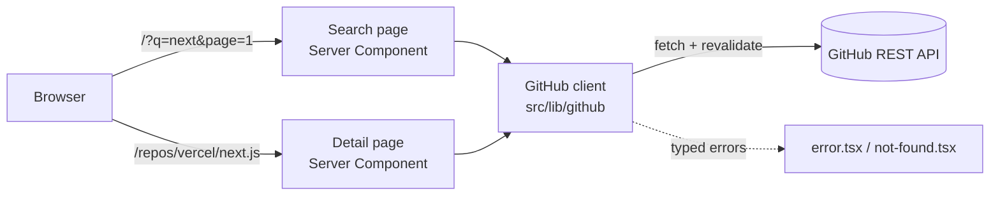

# Architecture

How this app is put together and why. Decisions that were considered and rejected are recorded here too — for a selection task, the reasoning is part of the deliverable.

## Shape of the system

This is a **stateless read-through client for the GitHub REST API**. There is no database, no session, and no user identity. Every view is derived from a GitHub response; nothing is owned locally.



The browser never calls GitHub directly. Both routes are Server Components that call the client module on the server, which means the optional token never reaches the client bundle and there is no client-side API layer to maintain.

## Directory layout

```
src/
  app/
    page.tsx                        Search — reads ?q= and ?page= from searchParams
    loading.tsx                     Search loading state
    error.tsx                       Search error boundary
    repos/[owner]/[repo]/
      page.tsx                      Detail — its own route, not a modal
      loading.tsx
      error.tsx
      not-found.tsx                 Unknown owner/repo
  components/
    SearchForm.tsx                  Client Component — the only interactive island
    RepoList.tsx  RepoCard.tsx
    RepoDetail.tsx
    Pagination.tsx
  lib/github/
    client.ts                       fetch wrapper: base URL, headers, auth, status mapping
    search.ts                       searchRepositories()
    repo.ts                         getRepository()
    errors.ts                       RateLimitError | NotFoundError | ValidationError | NetworkError
  types/
    github.ts                       Response shapes
```

Tests are colocated as `*.test.ts(x)` beside their subject; E2E specs live in `e2e/`.

## Key decisions

### Server Components fetch the data

Rendering happens on the server, so the GitHub call happens there too. This keeps `GITHUB_TOKEN` server-side by construction rather than by discipline, removes a whole client-side fetching layer, and means the detail page is directly linkable and refreshable with no hydration dance.

`SearchForm` is the one Client Component — it needs input state. It submits by navigating, so results come from the server.

### URL is the state

The keyword and page number live in the query string (`/?q=next&page=2`), not React state.

This is the decision that most affects usability, which is what the brief says is graded. Results become shareable, the back button behaves, refresh preserves what you were looking at, and the server can render the correct page on first request. It also removes the need for any state management library.

### Typed errors, distinct UI

`client.ts` maps HTTP status to a typed error rather than throwing raw responses:

| Condition | Error | What the user sees |
|---|---|---|
| 403/429 with rate-limit headers | `RateLimitError` | "GitHub rate limit reached — try again in N seconds" |
| 404 | `NotFoundError` | Not-found page |
| 422 | `ValidationError` | Guidance to refine the query |
| Network / unknown | `NetworkError` | Generic retry message |

This exists because the failure modes are genuinely different and collapsing them is the common mistake: a rate-limited search that renders as "no results found" is actively misleading, and it is the state a reviewer is most likely to hit.

### Caching instead of infrastructure

Rate-limit pressure is handled by Next's fetch cache with `revalidate`, not by a cache service. Repeated searches and detail views inside the window cost zero API calls. One line, no container, no failure mode.

### `subscribers_count` for watchers

A GitHub API quirk worth stating plainly: REST `watchers_count` is a **duplicate of `stargazers_count`**. The real watcher count is `subscribers_count`, and it is only present on the detail endpoint.

The brief lists stars and watchers as separate required fields, so using the obvious field would render two identical numbers and look like a bug. The detail page uses `subscribers_count` for watchers, and the README says so.

## Rejected alternatives

| Considered | Rejected because |
|---|---|
| **MongoDB / any database** | Nothing to persist — GitHub owns the data. Local setup is currently `npm install && npm run dev` with zero services; a DB would add a container, a connection string, and a seed step to solve a problem the app does not have. Unnecessary infrastructure is the clearest over-engineering signal in a code review. |
| **GitHub OAuth / user accounts** | Not in the brief. Searching public repositories needs no identity. Inventing scope costs review credibility and adds real security surface. |
| **Client-side fetching (SWR / React Query)** | Would force the token into the browser or require a proxy route to avoid it. Server Components solve both for free. Sensible if this app had heavy client-side interactivity; it does not. |
| **Route Handlers as an API layer** | A `/api/*` proxy in front of a Server Component that could call GitHub directly is an indirection with no consumer. Would be justified only if the client needed to fetch. |
| **Redux / Zustand** | The only state is the search keyword and page, and both belong in the URL. |
| **Modal for repository detail** | Explicitly forbidden by the brief. |
| **A component library (shadcn/ui)** | Permitted but optional. Design is not graded, and hand-written components keep the diff small and readable for reviewers. |

## Local development

```bash
nvm use          # Node 20.20.1 — the default Node 18 cannot run Next 16
npm install
npm run dev
```

No services, no containers, no database. The app is fully functional unauthenticated.

`GITHUB_TOKEN` is optional. Unauthenticated GitHub search allows ~10 requests/minute; a token raises that to ~30/min and lifts the core REST limit from 60/hour to 5,000/hour. It is read server-side only — never `NEXT_PUBLIC_`, never committed. See `.env.example`.

## Quality gate

CI runs on every PR ([`.github/workflows/ci.yml`](../.github/workflows/ci.yml)):

| Job | Checks |
|---|---|
| `quality` | ESLint, `tsc --noEmit`, Vitest with coverage, `next build` |
| `e2e` | Playwright — **GitHub API intercepted**, never called live |
| `security` | CodeQL SAST, `npm audit`, gitleaks secret scanning |
| `a11y` | axe against the running build |

Plus Dependabot for dependency updates.

**Why E2E mocks the API:** CI runners share IPs and are aggressively rate-limited by GitHub. Unmocked E2E would fail intermittently for reasons unrelated to the code, and a flaky pipeline is worse than no pipeline.

**Why no DAST:** ZAP needs a deployed target, and this app has no auth, no session, no datastore, and one input that never reaches a query engine. A baseline scan would report header configuration and nothing more. Listed in `.planning/REQUIREMENTS.md` under v2 as something a real production deployment would add.
